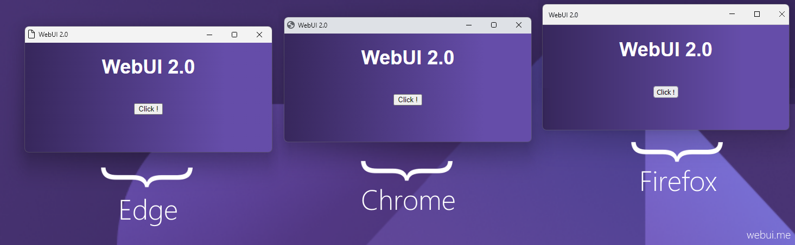
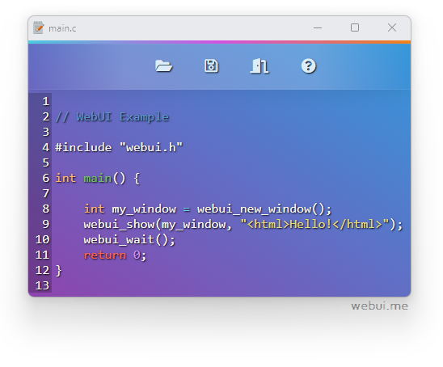
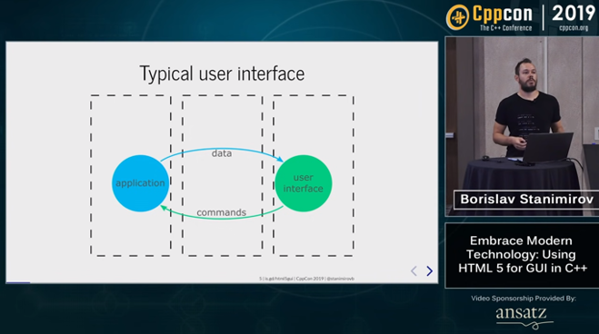

# Webinix Deno v2.4.0

[](https://github.com/webinix-dev/deno-webinix)
[](https://github.com/webinix-dev/deno-webinix/issues)
[](https://webinix.me/)

> Use any web browser as GUI, with Deno in the backend and HTML5 in the
> frontend, all in a lightweight Deno module.



## Features

- Fully Independent (_No need for any third-party runtimes_)
- Lightweight _~900 Kb_ for the whole package & Small memory footprint
- Fast binary communication protocol between Webinix and the browser (_Instead of
  JSON_)
- Multi-platform & Multi-Browser
- Using private profile for safety
- Original library written in Pure C

## Screenshot

This
[text editor example](https://github.com/webinix-dev/deno-webinix/tree/main/examples)
is written in Deno using Webinix as the GUI library.



## Installation

`import { Webinix } from "https://deno.land/x/webinix/mod.ts";`

## Minimal Example

```js
import { Webinix } from "https://deno.land/x/webinix/mod.ts";

const myWindow = new Webinix();
webinix.show("<html>Hello World</html>");
await Webinix.wait();
```

_MacOS ARM_: To get deno-webinix working with an Apple Silicon Mac, you'll need to build [Webinix](https://github.com/webinix-dev/webinix) your self then pass the path to your dylib:

```js
const myWindow = new Webinix({
  libPath: "/path/to/webinix-2.dylib",
  clearCache: false,
});
```

## Repository Examples

- Hello world example:
  ```sh
  deno run -A --unstable https://deno.land/x/webinix/examples/hello_world/hello_world.ts
  ```
- Manage multi windows:
  ```sh
  deno run -A --unstable https://deno.land/x/webinix/examples/multi_windows/main.ts
  ```
- Browse your local filesystem
  ```sh
  deno run -A --unstable https://deno.land/x/webinix/examples/file_explorer/main.ts
  ```

[More examples](https://github.com/webinix-dev/deno-webinix/tree/main/examples)

## Security flags

Minimal required flags for running the module are:

| flag        | value                                  | purpose                                  |
| ----------- | -------------------------------------- | ---------------------------------------- |
| unstable    | NA                                     | FFI UnsafePointer and UnsafeCallback use |
| allow-env   | USERPROFILE (windows) or HOME (others) | Caching dynamic library                  |
| allow-write | ~/.deno_webinix                          | Saving cache                             |
| allow-read  | ~/.deno_webinix                          | Opening cache                            |
| allow-ffi   | ~/.deno_webinix (unstable so allow all)  | Using FFI                                |

Example:

```sh
deno run --unstable --allow-env=HOME --allow-ffi --allow-read=~/.deno_webinix --allow-write=~/.deno_webinix https://deno.land/x/webinix/examples/hello_world/hello_world.ts
```

You can see all permissions prompt by using `deno run` without any.

## Documentation

- [Online Documentation](https://webinix.me/docs/#/deno_api)

## CppCon 2019 Presentation

[Borislav Stanimirov](https://ibob.bg/) explained at
[C++ Conference 2019 (_YouTube_)](https://www.youtube.com/watch?v=bbbcZd4cuxg)
how beneficial it is to use the web browser as GUI.

<!-- <div align="center">
  <a href="https://www.youtube.com/watch?v=bbbcZd4cuxg"></a>
</div> -->



## UI & The Web Technologies

Web application UI design is not just about how a product looks but how it
works. Using web technologies in your UI makes your product modern and
professional, And a well-designed web application will help you make a solid
first impression on potential customers. Great web application design also
assists you in nurturing leads and increasing conversions. In addition, it makes
navigating and using your web app easier for your users.

## Why Use Web Browser?

Today's web browsers have everything a modern UI needs. Web browsers are very
sophisticated and optimized. Therefore, using it as a GUI will be an excellent
choice. While old legacy GUI lib is complex and outdated, a WebView-based app is
still an option. However, a WebView needs a huge SDK to build and many
dependencies to run, and it can only provide some features like a real web
browser. That is why Webinix uses real web browsers to give you full features of
comprehensive web technologies while keeping your software lightweight and
portable.

## How does it work?


Think of Webinix like a WebView controller, but instead of embedding the WebView
controller in your program, which makes the final program big in size, and
non-portable as it needs the WebView runtimes. Instead, by using Webinix, you use
a tiny static/dynamic library to run any installed web browser and use it as
GUI, which makes your program small, fast, and portable. **All it needs is a web
browser**.

## Runtime Dependencies Comparison

|                                 | WebView           | Qt                         | Webinix               |
| ------------------------------- | ----------------- | -------------------------- | ------------------- |
| Runtime Dependencies on Windows | _WebView2_        | _QtCore, QtGui, QtWidgets_ | _**A Web Browser**_ |
| Runtime Dependencies on Linux   | _GTK3, WebKitGTK_ | _QtCore, QtGui, QtWidgets_ | _**A Web Browser**_ |
| Runtime Dependencies on macOS   | _Cocoa, WebKit_   | _QtCore, QtGui, QtWidgets_ | _**A Web Browser**_ |

## Supported Web Browsers

| OS      | Browser         | Status           |
| ------- | --------------- | ---------------- |
| Windows | Mozilla Firefox | ✔️                |
| Windows | Google Chrome   | ✔️                |
| Windows | Microsoft Edge  | ✔️                |
| Windows | Chromium        | ✔️                |
| Windows | Yandex          | ✔️                |
| Windows | Brave           | ✔️                |
| Windows | Vivaldi         | ✔️                |
| Windows | Epic            | ✔️                |
| Windows | Opera           | _coming soon_    |
| -       | -               | -                |
| Linux   | Mozilla Firefox | ✔️                |
| Linux   | Google Chrome   | ✔️                |
| Linux   | Microsoft Edge  | ✔️                |
| Linux   | Chromium        | ✔️                |
| Linux   | Yandex          | ✔️                |
| Linux   | Brave           | ✔️                |
| Linux   | Vivaldi         | ✔️                |
| Linux   | Epic            | _Does Not Exist_ |
| Linux   | Opera           | _coming soon_    |
| -       | -               | -                |
| macOS   | Mozilla Firefox | ✔️                |
| macOS   | Google Chrome   | ✔️                |
| macOS   | Microsoft Edge  | ✔️                |
| macOS   | Chromium        | ✔️                |
| macOS   | Yandex          | ✔️                |
| macOS   | Brave           | ✔️                |
| macOS   | Vivaldi         | ✔️                |
| macOS   | Epic            | ✔️                |
| macOS   | Apple Safari    | _coming soon_    |
| macOS   | Opera           | _coming soon_    |

## Supported Languages

| Language                | Status         | Link                                                      |
| ----------------------- | -------------- | --------------------------------------------------------- |
| C/C++                   | ✔️              | [Webinix](https://github.com/webinix-dev/webinix)               |
| Python                  | ✔️              | [Python-Webinix](https://github.com/webinix-dev/python-webinix) |
| TypeScript / JavaScript | ✔️              | [Deno-Webinix](https://github.com/webinix-dev/deno-webinix)     |
| Go                      | ✔️              | [Go-Webinix](https://github.com/webinix-dev/go-webinix)         |
| Rust                    | _Not Complete_ | [Rust-Webinix](https://github.com/webinix-dev/rust-webinix)     |
| V                       | ✔️              | [V-Webinix](https://github.com/webinix-dev/v-webinix)           |
| Nim                     | ✔️              | [Nim-Webinix](https://github.com/webinix-dev/nim-webinix)       |
| Zig                     | _Not Complete_ | [Zig-Webinix](https://github.com/webinix-dev/zig-webinix)       |

### License

> Licensed under MIT License.

### Stargazers

[](https://github.com/webinix-dev/deno-webinix/stargazers)
